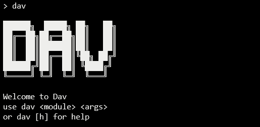

# Dav
>An extensible interface for your projects and scripts

From file management or checking email to pretty much whatever you want. 
This cli allows you to easily access your scripts and projects from the command line.

## Installation

* With git:
```sh
# clone it to your home directory
git clone https://github.com/davidsongoap/dav-cli.git
cd dav-cli
pip install -r Requirements.txt
```
Or download the zip, place it in your home directory and install the requirements
* Now add the path ```dav-cli\dist\dist-win\``` to your environment variables
* Try it out!


## Requirements
Python 3.x

## Adding new modules
* Create a new folder with your own files
```
dav-cli
│
└───modules
│   │   ...
│   └───mynewmodule
│       │   ...
│       └───template.py
...
```
* Add the new module to the config file
 ```json
"custom module name": {
  "module": "mynewmodule",
  "tag": [
    "temp"
  ],
  "file": "template.py",
  "description": "template module. use dav [temp]"
  "runwith": "python"
}
```